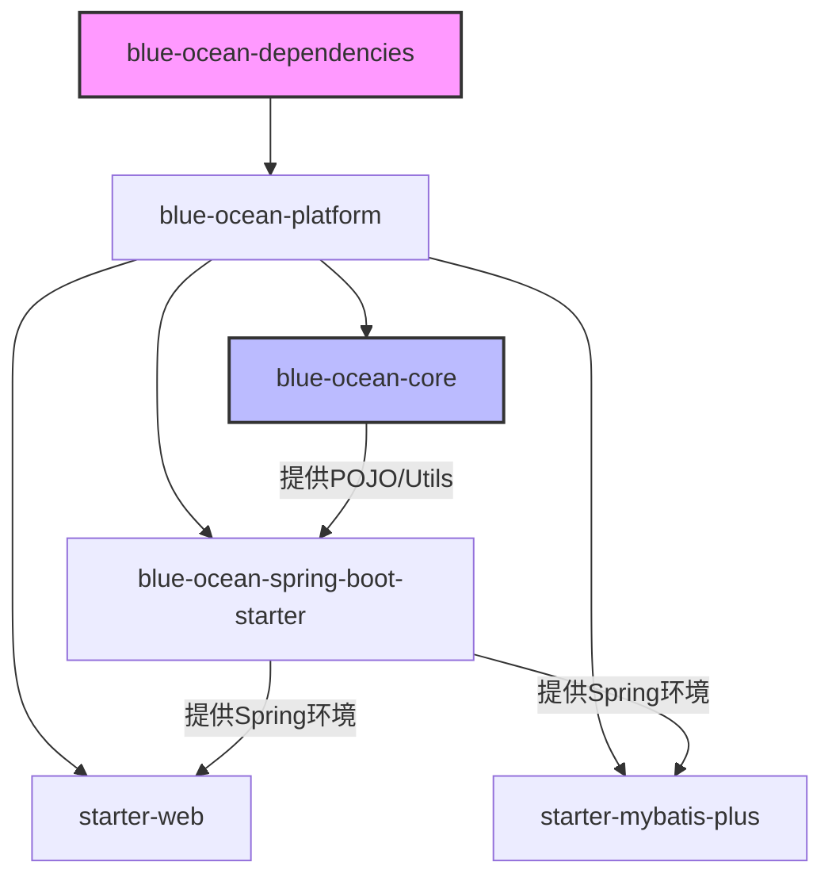

# 🌊 Blue Ocean Platform 基础架构工程设计方案

> **Build Less, Create More.** 基于 Spring Boot 的高内聚、低耦合、开箱即用的企业级开发底座。

| 项目信息 | 内容 |
| :--- | :--- |
| **JDK 版本** | 21+ |
| **Spring Boot** | 3.5.x |

-----

## 📖 1. 项目背景与建设目标

### 1.1 背景

在日常的微服务或分布式开发中，团队往往面临以下痛点：

* **重复造轮子**：每个项目都要重新写一套统一返回值、全局异常处理、MyBatis 配置和公共工具类，严重浪费开发时间。
* **规范不统一**：不同项目由不同人员搭建，导致接口风格迥异，异常码定义混乱，维护成本高昂。
* **依赖地狱**：第三方依赖版本管理混乱，升级困难。

### 1.2 建设目标

**Blue Ocean (蓝海平台)** 旨在解决上述问题，提供一套标准化的技术基石：

* 🎯 **统一规范**：强制统一 API 响应格式 (`Result`)、异常编码 (`RespCode`)、日期序列化格式等。
* 🚀 **提效开发**：通过自定义 Starter (`Web`, `MyBatis-Plus`) 屏蔽底层繁琐配置，业务开发只需引入依赖即可专注业务逻辑。
* 🛡️ **隔离复杂**：将多租户处理、数据权限、防全表更新等复杂逻辑下沉到底座，对业务层透明。
* ⚖️ **版本仲裁**：通过 BOM (`Dependencies`) 统一管理第三方依赖版本，彻底避免“依赖地狱”。

-----

## 🏗️ 2. 总体架构设计

本项目采用 **Maven 多模块 (Multi-Module)** 架构，遵循 **Core + Starter** 的分层设计原则，确保模块职责单一、依赖清晰。

### 2.1 工程拓扑结构

```text
blue-ocean-platform (Root Aggregator & Parent)
├── blue-ocean-dependencies (BOM - 版本控制中心)
├── blue-ocean-core (核心通用模块 - 纯净 Java 工具)
├── blue-ocean-spring-boot-starter (基础底座 - 上下文与 AOP)
├── blue-ocean-spring-boot-starter-web (Web 增强 - MVC 扩展)
└── blue-ocean-spring-boot-starter-mybatis-plus (数据增强 - MP 扩展)
```

### 2.2 模块依赖关系图



-----

## 📦 3. 核心模块实现方案

### 3.1 💎 Core 模块 (`blue-ocean-core`)

**定位**：系统的“血液”，保持绝对纯净，不依赖具体的 Web 或 DB 框架，仅包含通用对象。

* **API 协议**：定义统一响应体 `Result<T>`、分页响应 `PageResult<T>`。
* **异常体系**：定义业务异常 `BusinessException` 及全局错误码接口 `RespCode`。
* **上下文模型**：定义 `CurrentUserInfo` 及基于 `ThreadLocal` 的 `UserContextUtil`，实现跨模块的用户信息透传。
* **常量枚举**：全局配置常量、数据库状态枚举等。

### 3.2 ⚙️ 基础 Starter (`blue-ocean-spring-boot-starter`)

**定位**：系统的“骨架”，提供 Spring 上下文感知能力。

* **SpringUtil**：实现 `ApplicationContextAware`，解决在静态方法或非 Bean 对象中无法获取 Spring Bean 的痛点。
* **基础聚合**：聚合 `spring-boot-starter`、`spring-boot-starter-aop`，业务方引入此模块即可获得基础 Spring 能力。

### 3.3 🌐 Web 增强 Starter (`starter-web`)

**定位**：Web 层的“防盗门”与“翻译官”。

* **全局异常处理 (`GlobalExceptionHandler`)**：
    * 统一拦截 `BusinessException`、参数校验异常 (`MethodArgumentNotValidException`)、404 等系统异常。
    * 将异常转换为标准的 JSON 结构，前端不再面对 500 堆栈信息。
* **Jackson 序列化增强**：
    * **Long 转 String**：解决前端 JavaScript 丢失 19 位 Long 类型精度的问题。
    * **日期格式化**：统一处理 JDK8 日期类型 (`LocalDateTime`) 的序列化格式。
* **配置聚合**：采用 `@Import` 聚合模式，通过 `WebProperties` (前缀 `blue-ocean.web`) 统一管理开关。

### 3.4 💾 MyBatis-Plus 增强 Starter (`starter-mybatis-plus`)

**定位**：数据层的“管家”。

* **自动填充 (`MetaObjectHandler`)**：插入/更新时自动填充 `createdTime`, `updatedTime`, `createdBy`, `updatedBy` (自动从 Core 的 `UserContextUtil` 获取当前用户)。
* **插件体系**：
    * **多租户插件**：支持 SaaS 场景下的数据隔离 (`TenantLineHandler`)。
    * **分页插件**：集成物理分页。
    * **安全插件**：防止全表更新/删除 (`BlockAttackInnerInterceptor`)。
* **BaseEntity**：提供实体基类，封装 ID、审计字段、逻辑删除字段。

-----

## 🚀 4. 接入指南 (Quick Start)

### 4.1 引入依赖

在业务服务的 `pom.xml` 中引入需要的 Starter。**注意：必须先引入 BOM 以进行版本仲裁。**

```xml
<!-- 1. 引入版本管理 (BOM) -->
<dependencyManagement>
    <dependencies>
        <dependency>
            <groupId>com.cecilylove</groupId>
            <artifactId>blue-ocean-dependencies</artifactId>
            <version>1.0.0</version>
            <type>pom</type>
            <scope>import</scope>
        </dependency>
    </dependencies>
</dependencyManagement>

<dependencies>
    <!-- 2. Web 开发引入 -->
    <dependency>
        <groupId>com.cecilylove</groupId>
        <artifactId>blue-ocean-spring-boot-starter-web</artifactId>
    </dependency>

    <!-- 3. 数据库开发引入 -->
    <dependency>
        <groupId>com.cecilylove</groupId>
        <artifactId>blue-ocean-spring-boot-starter-mybatis-plus</artifactId>
    </dependency>
</dependencies>
```

### 4.2 配置文件示例 (`application.yml`)

底座组件提供了统一的配置前缀 `blue-ocean`，您可以按需开启或关闭功能。

```yaml
blue-ocean:
  # Web 模块配置
  web:
    enabled: true
    global-exception-handler:
      enabled: true  # 开启全局异常拦截
    jackson:
      enabled: true
      enable-date-format: true
      date-format: "yyyy-MM-dd HH:mm:ss"
      time-zone: "GMT+8"
      enable-long-to-string: true # 开启 Long -> String 精度处理

  # MyBatis-Plus 模块配置
  mybatis-plus:
    enabled: true
    db-type: MYSQL
    enable-pagination: true
    enable-optimistic-locker: true
    enable-block-attack: true
    enable-tenant-line: true
```

-----

## 🛠️ 5. 开发规范与扩展

### 5.1 异常处理规范

业务代码中遇到错误时，请**直接抛出异常**，严禁手动返回错误码对象。

```java
// ✅ 推荐写法
if (user == null) {
    throw new BusinessException(CommonRespCode.PARAM_ERROR, "用户不存在");
}

// ❌ 不推荐写法 (底座无法拦截处理)
if (user == null) {
    return Result.error(CommonRespCode.PARAM_ERROR.getCode(), "用户不存在");
}
```

### 5.2 数据库实体规范

所有实体类建议继承 `BaseEntity`，以利用自动填充特性。

```java
@Data
@TableName("t_order")
public class Order extends BaseEntity {
    private String orderNo;
    // id, createdTime, deleted 等字段已由父类 BaseEntity 提供，无需重复定义
}
```

### 5.3 如何扩展新的 Starter？

如果您需要新增一个功能模块（例如 Redis 增强），请遵循以下标准化步骤：

1.  **创建模块**：命名为 `blue-ocean-spring-boot-starter-redis`。
2.  **引入依赖**：引入 `spring-boot-starter-data-redis` 和 `blue-ocean-core`。
3.  **编写配置**：
    * 创建 `RedisProperties` (`@ConfigurationProperties`)。
    * 创建 `RedisAutoConfiguration`，使用 `@ConditionalOnProperty` 控制加载。
4.  **注册 SPI**：在 `META-INF/spring/org.springframework.boot.autoconfigure.AutoConfiguration.imports` 中注册配置类。

-----

## 📅 6. 维护计划

* **当前版本**: `1.0.0` (基础功能闭环)
* **下个版本规划**:
    * 集成 Redis Starter (分布式锁、缓存封装)
    * 集成 Log Starter (TraceId 链路追踪)
